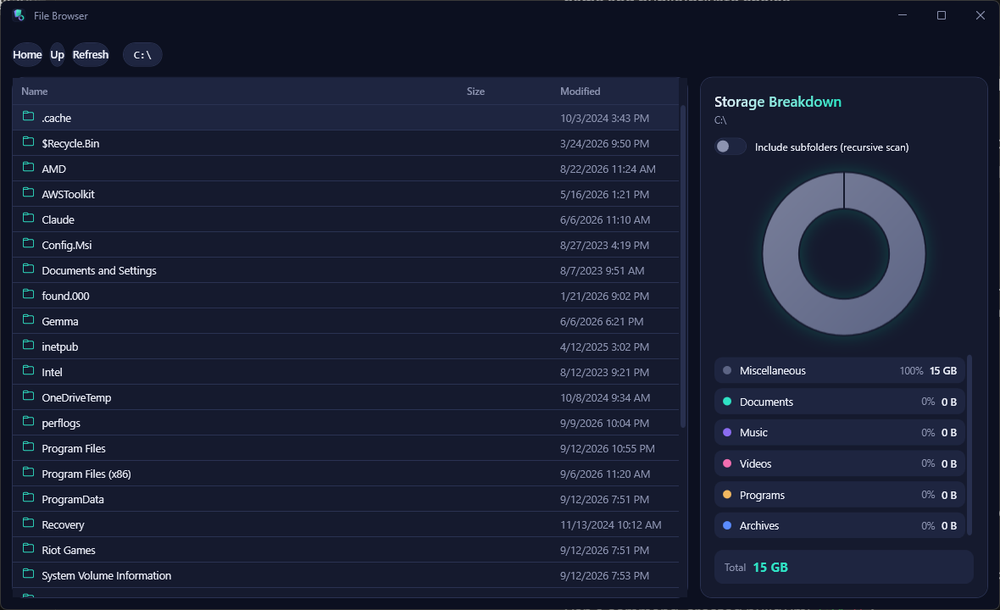

# File Browser




> This is my first experiment building an app with [Claude Code](https://claude.com/claude-code)
> — an AI coding agent — going from an empty folder to a fully themed, working Windows desktop
> app entirely through conversation.

A dark-themed Windows desktop file browser with a live storage-breakdown infographic. Browse
your filesystem like a normal file explorer, and watch a donut chart break down the current
folder (optionally recursively) into Documents / Music / Videos / Programs / Archives /
Miscellaneous by file extension.

## Features

- Full filesystem navigation — drives, folders, files, with size and modified date
- Live storage breakdown infographic (donut chart + legend), per-folder or recursive
- Cancel button for recursive scans of huge directories
- Graceful handling of permission-denied folders and locked/inaccessible files — never crashes
- Custom dark "Aurora" theme with a seamless, native-chrome-free title bar (Discord/Edge-style)

## Requirements

Windows 10/11 + [.NET 8 SDK](https://dotnet.microsoft.com/download/dotnet/8.0) to build; the
app itself is WPF, so it only runs on Windows.

```bash
dotnet build
dotnet run --project FileBrowserApp\FileBrowserApp.csproj
```

---

## Developer guide

The rest of this document is a handover reference for whoever maintains this code next — it
covers how the app is put together, why some non-obvious things exist, and where to look when
you need to change something.

## 1. Tech stack & requirements

| | |
|---|---|
| UI framework | WPF (Windows Presentation Foundation) |
| Runtime | .NET 8 (`net8.0-windows`) |
| Language | C# 12, nullable reference types on, implicit usings on |
| MVVM library | **None** — a ~20-line hand-rolled `ObservableObject`/`RelayCommand` pair (see §5) |
| External packages | **None.** No NuGet dependencies at all. |
| Platform | Windows only (WPF, plus a couple of raw `user32.dll`/`dwmapi.dll` P/Invoke calls). Will not run on macOS/Linux, including under Mono. |

Building requires the .NET 8 SDK (`dotnet --version` → `8.x`). If only the runtime is
installed, `dotnet build` will fail with no SDK found — install via
`winget install Microsoft.DotNet.SDK.8` or the Visual Studio installer.

## 2. Getting started

```
FileBrowserApp\                    <- solution folder (.sln lives here)
  FileBrowserApp.sln
  FileBrowserApp\                  <- the actual project (.csproj lives here)
    FileBrowserApp.csproj
    ...
```

From the solution folder:

```bash
dotnet build                # builds FileBrowserApp.sln
dotnet run --project FileBrowserApp\FileBrowserApp.csproj
```

Or open `FileBrowserApp.sln` in Visual Studio / Rider and hit Run — no extra setup, no
`appsettings`, no environment variables, no external services.

There is **no automated test suite**. Everything so far has been verified by manual/scripted
UI testing during development (see §8). If you add tests, the natural split is: `Services/`
and `Models/` are pure and easily unit-testable (no filesystem mocking needed for
`CategorizationService`/`StorageAnalyzer`/`SizeFormatter`); `FileSystemService` needs either a
temp-directory-based integration test or an `IFileSystemService` abstraction to be introduced
first (it isn't abstracted today — see §7).

## 3. What the app does

- Left pane: a `DataGrid` file browser. Starts at a "This PC" drive list, double-click a
  folder to enter it, `Up`/`Home`/`Refresh` to navigate, shows name/size/modified date.
- Right pane: a donut chart + legend breaking down the **current folder's** files by category
  (Documents / Music / Videos / Programs / Archives / Miscellaneous), based on extension.
  A toggle switches between "this folder only" and a full recursive scan of the subtree.
- Custom-drawn dark ("Aurora") theme throughout, including a borderless window with its own
  title bar (no native Windows chrome) — see §6.4.

## 4. Project structure

```
Models/          Plain data types. No logic, no I/O.
Services/        All real work: filesystem access, categorization, aggregation. No UI types.
ViewModels/      MainViewModel (the only ViewModel) + the hand-rolled MVVM base classes.
Controls/        DonutChart (custom FrameworkElement) + CategoryPalette (color lookup).
Converters/      IValueConverter/IMultiValueConverter implementations used by XAML bindings.
Theme/           DarkAuroraTheme.xaml — every color and control style lives here.
Assets/          App icon (source .svg + baked .ico + a .png used by the in-app title bar).
MainWindow.xaml(.cs)   The only window. XAML is pure layout/binding; code-behind is view glue only.
App.xaml(.cs)          Standard WPF entry point, merges the theme dictionary.
```

The layering is strict and worth preserving:

```
MainWindow.xaml  →  MainViewModel  →  FileSystemService / CategorizationService / StorageAnalyzer
   (view)              (state,            (I/O, pure logic — no knowledge of WPF, ViewModels,
                    commands, async           or each other beyond simple data)
                      orchestration)
```

`FileSystemService` doesn't know `MainViewModel` exists. `MainViewModel` doesn't know WPF
exists (it's plain `ObservableObject`/`RelayCommand`, no `System.Windows` types except via
`ObservableCollection`). Keep it that way — it's what makes the pieces independently
readable and (eventually) testable.

## 5. The hand-rolled MVVM layer

There's no CommunityToolkit.Mvvm / Prism / ReactiveUI — just:

- **`ObservableObject`** (`ViewModels/ObservableObject.cs`): `INotifyPropertyChanged` +
  a `SetProperty<T>(ref field, value)` helper using `[CallerMemberName]`. Standard boilerplate.
- **`RelayCommand`** (`ViewModels/RelayCommand.cs`): minimal `ICommand`. `CanExecuteChanged`
  is wired to `CommandManager.RequerySuggested`, which means button enabled/disabled state
  (e.g. the "Up" button) re-evaluates on the next UI input event, not instantly on property
  change. This is a known WPF pattern, not a bug — if a `CanExecute` predicate ever needs to
  react *immediately* to a ViewModel property change, you'll need to raise
  `CommandManager.InvalidateRequerySuggested()` manually at that point, or upgrade to a
  proper MVVM toolkit.

This was a deliberate choice to keep the project dependency-free, not an oversight. If the
app grows ViewModels beyond `MainViewModel`, reconsider — CommunityToolkit.Mvvm's
`[ObservableProperty]`/`[RelayCommand]` source generators would remove a lot of this
boilerplate for a single small NuGet reference.

## 6. Key subsystems

### 6.1 Filesystem access (`Services/FileSystemService.cs`)

This is the trickiest file in the codebase and the one most likely to need care during edits.
Three entry points:

- `GetDrives()` — synchronous, used for the "This PC" root view.
- `ListDirectoryAsync(path, ct)` — lists one directory's immediate children. Throws
  `DirectoryAccessException` (a small custom exception, `Services/DirectoryAccessException.cs`)
  if the directory *itself* can't be opened (permission denied, gone, etc.) — the ViewModel
  catches this and shows the message in the status bar instead of crashing.
- `EnumerateFiles(rootPath, recursive, ct)` — a `yield return` iterator that walks a subtree
  (used for the recursive storage scan). Implemented as an explicit `Stack<string>` rather than
  recursion, so it can't stack-overflow on a deeply nested tree.

**The defensive pattern used throughout**: every `Directory.EnumerateFileSystemEntries`,
`File.GetAttributes`, `.Length`, `.LastWriteTimeUtc` call is wrapped in
`catch (Exception ex) when (ex is UnauthorizedAccessException or IOException)`. A folder you
can't read, a file that vanishes mid-scan, a OneDrive placeholder that fails to hydrate — none
of these should ever crash the browse/scan. If you add a new filesystem call anywhere in this
file, wrap it the same way or the whole point of this service is undermined.

**Why enumeration is manual instead of `Directory.GetFileSystemEntries` in a `foreach`**: a
plain `foreach` over `Directory.EnumerateFileSystemEntries(path)` throws away the ability to
skip a single bad entry — the first exception (even one raised while enumerating, not just
opening) kills the whole loop. Here the `IEnumerator` is pulled manually
(`using var enumerator = ...; while (true) { ... enumerator.MoveNext() ... }`) precisely so one
bad entry can be caught and skipped without losing the rest of the listing.

Cancellation is checked via `cancellationToken.ThrowIfCancellationRequested()` before *every*
`MoveNext()` — i.e. per-file, not per-directory — which is what makes cancelling a scan over a
huge tree (e.g. `C:\`) feel instant rather than waiting for the current directory to finish.

### 6.2 Categorization (`Services/CategorizationService.cs`)

Pure extension → `FileCategory` lookup, case-insensitive, built once into a `Dictionary` at
static-init time. To add a new extension or category, edit `BuildMap()` — it's a flat list of
`Add(category, "ext1", "ext2", ...)` calls, deliberately not data-driven/config-driven since
the list changes rarely and a hardcoded map is easier to read and diff than a JSON file.

Unknown/unmapped extensions fall into `FileCategory.Miscellaneous` (the enum default).

### 6.3 Storage aggregation (`Services/StorageAnalyzer.cs`) + the donut chart

`StorageAnalyzer.Aggregate(IEnumerable<FileSystemEntry>)` buckets files into a
`CategoryTotal` per `FileCategory` (all six categories always present, even at zero, so the
legend never has to handle a missing category) and returns them sorted descending by size.

`Controls/DonutChart.cs` is a custom `FrameworkElement` (not a `UserControl` — no XAML, it
draws itself in `OnRender` using `DrawingContext` + hand-built `StreamGeometry` annular
sectors). It takes a `Slices` dependency property (`IReadOnlyList<CategoryTotal>`) and knows
nothing about the filesystem — it's pure "turn (category, bytes) pairs into an annulus." The
math: each slice is `fraction * 360°` starting at -90° (12 o'clock), rendered as an outer arc +
line to inner radius + inner arc back, i.e. a standard "pie slice with the middle cut out"
path. If you need to change the donut's look (thickness, gap color, start angle), that's all
in `BuildAnnularSector`/`OnRender` — the constants `outerRadius = size/2 * 0.92` and
`innerRadius = outerRadius * 0.55` control the ring thickness.

Colors come from `Controls/CategoryPalette.cs` — a fixed `Dictionary<FileCategory, Color>`
with matching flat (`GetBrush`) and gradient (`GetGradientBrush`) brush variants, all frozen
(`Brush.Freeze()`) for render performance since they never change. The chart's "gap" stroke
between slices and its empty-state ring color are hardcoded to match the theme's surface color
(`#151A2E`) rather than looked up from the theme resource dictionary — this was a deliberate
call to keep `DonutChart` a self-contained, dependency-free rendering control rather than
coupling it to `Application.Current.Resources`. If the theme's background color ever changes,
this hardcoded value needs updating too (it's a magic-value duplication, flagged here on
purpose so it isn't a surprise later).

### 6.4 Custom window chrome (`MainWindow.xaml` + `MainWindow.xaml.cs`)

The window uses `WindowStyle="None"` + `System.Windows.Shell.WindowChrome` to get a seamless,
native-title-bar-free look (matching apps like Discord/Edge/Steam), with a hand-drawn title
row (icon, "File Browser" label, minimize/maximize/close buttons) instead.

Two things here are easy to break if touched carelessly:

1. **`WindowChrome.CaptionHeight="36"`** on the `shell:WindowChrome` in XAML makes the *entire*
   top 36px of the window act as a native title bar (drag-to-move, double-click-to-maximize)
   for free — **except** wherever `shell:WindowChrome.IsHitTestVisibleInChrome="True"` is set
   (the button `StackPanel`), which opts back into normal click handling. If you add new
   interactive controls to the title row, remember to mark them (or their container)
   `IsHitTestVisibleInChrome="True"`, or clicks on them will just drag the window instead.

2. **`FixMaximizedBounds()` in `MainWindow.xaml.cs`** hooks `WM_GETMINMAXINFO` via
   `HwndSource.AddHook`. This is *not* optional decoration — without it, a borderless
   `WindowChrome` window that gets maximized will size itself to the full monitor rectangle
   and **cover the taskbar**, a well-known WPF gotcha. The hook reports the monitor's
   *work area* (screen minus taskbar) instead of its full bounds. If this code ever looks like
   dead/unnecessary P/Invoke and someone is tempted to delete it "for simplicity" — don't;
   maximize the window afterward and check the taskbar is still visible.

The minimize/maximize/restore/close buttons are plain `Click` event handlers in code-behind
(not routed `SystemCommands`) — simplest option for three one-line handlers, see
`Minimize_Click`/`MaximizeRestore_Click`/`Close_Click`.

### 6.5 Theming (`Theme/DarkAuroraTheme.xaml`)

One `ResourceDictionary`, merged into `App.xaml.Resources`, containing:

- A small color palette (`Color.Background`, `Color.Surface`, `Color.AccentTeal`, etc.) and
  matching `SolidColorBrush`/`LinearGradientBrush` resources built from them.
- Custom `ControlTemplate`s for `ScrollBar`, `Button` (`Aurora.PillButton`,
  `Aurora.CaptionButton`, `Aurora.CaptionButton.Close`), `CheckBox` (`Aurora.ToggleSwitch`),
  `ProgressBar` (`Aurora.ProgressBar`, hand-animated indeterminate marquee since a custom
  template loses the default Aero animation), and implicit (no `x:Key`, so they apply
  automatically) styles for `DataGrid`/`DataGridRow`/`DataGridCell`/`DataGridColumnHeader`.

To restyle the whole app, this is the one file to edit. To reuse a color/brush somewhere new,
reference it by key (`{StaticResource AccentTealBrush}` etc.) rather than hardcoding a hex
value — the one deliberate exception to that rule is documented in §6.3 above.

Icon glyphs throughout the app (folder/file icons in the grid, window control buttons) use the
**Segoe Fluent Icons** font by codepoint (e.g. `"\uE921"`). This font ships with Windows 11 and
is present on most updated Windows 10 installs, but isn't guaranteed on older/unmodified
Windows 10 — if you ever need to support such a target, check glyph rendering there, or fall
back to Segoe MDL2 Assets codepoints (mostly identical) or vector icons.

## 7. Concurrency & cancellation model

`MainViewModel` holds two separate `CancellationTokenSource` fields:

- `_navigationCts` — cancels an in-flight directory listing when the user navigates again
  before it finished.
- `_scanCts` — cancels an in-flight (possibly huge, recursive) storage scan whenever: the user
  navigates elsewhere, toggles "Include subfolders" off, or hits the "Cancel" button next to
  the scanning indicator (`CancelScanCommand`, which just sets `IncludeSubfolders = false` —
  that alone cancels the old CTS and re-triggers a fast non-recursive recalculation).

Both follow the same shape: cancel the previous token, create a new one, store it, run the
async work, and in a `finally` block only clear "in progress" state if the CTS field still
points at *this* call's token (`if (_scanCts == cts) IsScanning = false;`) — this guards
against a stale, already-superseded call clearing state that a newer call just set. If you add
a third long-running operation to the ViewModel, follow this same pattern rather than reusing
one of the existing tokens for something unrelated.

`OperationCanceledException` is caught and swallowed everywhere it can occur — cancellation is
a normal, expected control-flow path here, not an error.

## 8. Testing status

No automated tests exist. What's been verified manually (and should be re-checked after any
change to the areas involved) each time the relevant area changes:

- Navigating into a folder, up, home, refresh; permission-denied folders (e.g.
  `C:\System Volume Information`) render as skipped/inaccessible rather than crashing.
- Recursive scan of a large real directory (`C:\`, hundreds of thousands of files) completes
  or cancels cleanly without freezing the UI (the scan runs on a background `Task.Run`).
- Window drag, resize, minimize, maximize/restore (via button *and* double-click), and — the
  important one — **maximize does not cover the taskbar**.
- Close button exits cleanly (no orphaned process).

If you introduce a test project, `Services/` is the highest-value target since it's pure
logic/I/O with no WPF dependency.

## 9. Common maintenance tasks — quick recipes

**Add a new file category or extension** → `CategorizationService.BuildMap()`. If adding a
whole new `FileCategory`, also add a color for it in `CategoryPalette.Colors`.

**Add a column to the file list** → `MainWindow.xaml`, inside `DataGrid.Columns`. Bind
directly to a `FileSystemEntry` property, or add a new converter in `Converters/` if the raw
value needs formatting (follow the existing converters as a template — they're all tiny and
single-purpose).

**Change theme colors** → `Theme/DarkAuroraTheme.xaml`, the `Color.*` keys near the top.

**Add a title-bar button** → `MainWindow.xaml`'s title-bar `StackPanel` (`Grid.Column="2"`),
styled with `Aurora.CaptionButton` (or `.Close` for a destructive one), remembering the
`IsHitTestVisibleInChrome` note in §6.4.

**Change what counts as "recursive"** → `MainViewModel.RecalculateStorageAsync()` — the
`recursive` local is just `IncludeSubfolders`; the actual walk is
`FileSystemService.EnumerateFiles`.
